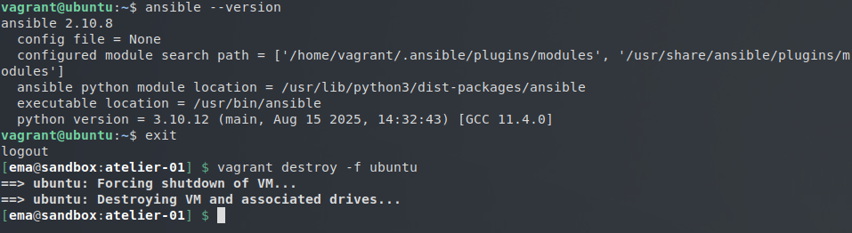
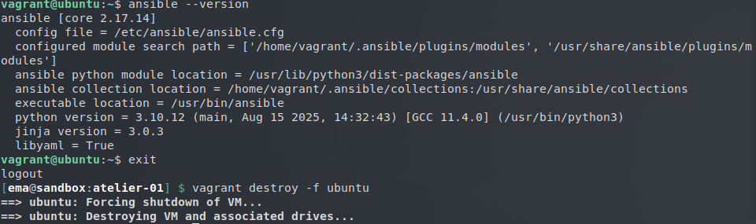
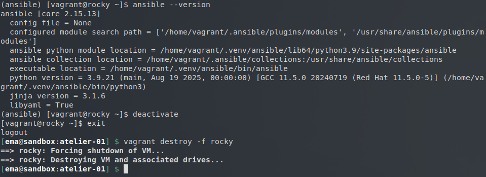

# Installation d'Ansible sur Ubuntu

Étant donné qu'Ubuntu est basé sur Debian, le gestionnaire de paquets (`apt`) et les commandes associées sont exactement les mêmes que ceux utilisés pour la VM Debian.

## Résolution du Challenge n°1

### 1. Démarrage de la VM Ubuntu depuis le répertoire `atelier-01`

```
vagrant up ubuntu
```

### 2. Connection à cette VM
```
vagrant ssh ubuntu
```
### 3. On raffraichi les informations sur les paquets
```
sudo apt update
```
### 4. On rerche le paquet ansible avec les options appropriées
``` 
apt-cache search --names-only ansible
```
### 5. On installet le paquet officiel fourni par la distribution
```
sudo apt install -y ansible
```
### 6. Vérification si l'installation s'est bien déroulée
```
ansible --version
```


### 7.Déconnection et suppression la VM
```
exit
vagrant destroy -f ubuntu
```
---


## Résolution du Challenge n°2

Ce second exercice a consisté à répéter le déploiement en intégrant cette fois-ci un dépôt PPA, dans le but d'observer les différences de gestion de paquets.
### 1. Initialisation et connexion

Une nouvelle instance de la machine virtuelle Ubuntu a été montée et accédée en SSH :
```
vagrant up ubuntu
vagrant ssh ubuntu
```
#### 2. Ajout du dépôt tiers et installation

Le dépôt PPA officiel maintenu par le projet Ansible a été ajouté aux sources du système. Après une mise à jour de la liste des paquets Ansible a été installé :
```
sudo apt-add-repository ppa:ansible/ansible
sudo apt update
sudo apt install -y ansible
```
### 3. Vérification et comparaison des versions

La version issue du dépôt PPA a été affichée pour être comparée à la précédente :
```
ansible --version
```


L'observation a montré que la version d'Ansible fournie par le dépôt PPA est plus récente que celle installée lors du Challenge 1. Cette différence s'explique par le fait que les dépôts officiels d'Ubuntu figent les versions pour garantir la stabilité globale du système, tandis que le dépôt PPA est directement mis à jour par les développeurs d'Ansible avec les dernières versions stables.

### 4. Suppression de l'environnement

Comme pour l'exercice précédent, la session a été fermée et l'instance Vagrant a été détruite pour libérer les ressources :
```
exit
vagrant destroy -f ubuntu
```

---


## Résolution du Challenge n°3
Ce troisième exercice s'est concentré sur l'installation d'Ansible via le gestionnaire de paquets Python au sein d'un environnement virtuel, en s'appuyant cette fois-ci sur une distribution Rocky Linux.

### 1. Initialisation et connexion
Une machine virtuelle sous Rocky Linux a été déployée, suivie de l'ouverture d'une session SSH :

```
vagrant up rocky
vagrant ssh rocky
```
### 2. Préparation de l'environnement Python

Le gestionnaire de paquets PIP a été installé :
```
sudo dnf install -y python3-pip
python3 -m venv ~/.venv/ansible
```
### 3. Activation et installation d'Ansible

L'environnement virtuel a été activé pour isoler l'installation. L'outil PIP a d'abord été mis à jour, puis Ansible a été installé via ce dernier :
```
source ~/.venv/ansible/bin/activate
pip install --upgrade pip
pip install ansible
```
 ### 4. Contrôle de l'installation

La vérification de la version d'Ansible a permis de confirmer le succès de l'opération dans le cadre isolé de Virtualenv :

```
ansible --version
```

L'approche par PIP et Virtualenv s'est avérée particulièrement pertinente pour installer une version récente d'Ansible sans risquer de créer des conflits avec les paquets Python du système hôte.

5. Nettoyage et suppression de l'environnement

Pour finaliser l'exercice, l'environnement virtuel a été quitté, la session a été clôturée et l'instance a été détruite de manière définitive :
```
deactivate
exit
vagrant destroy -f rocky
```
