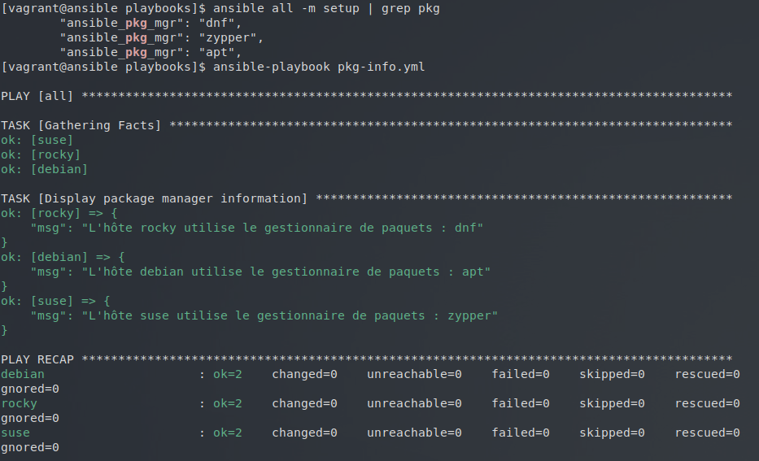
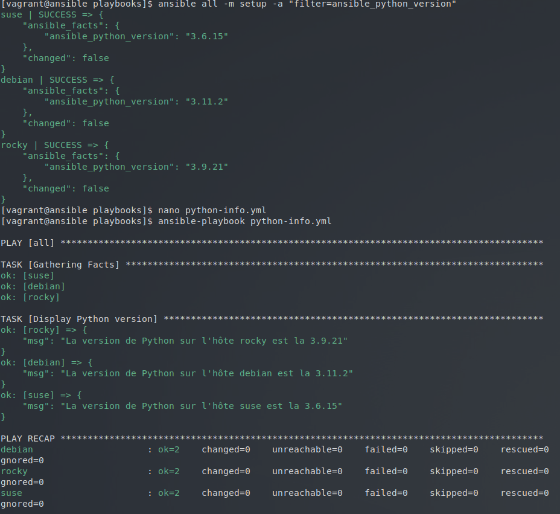
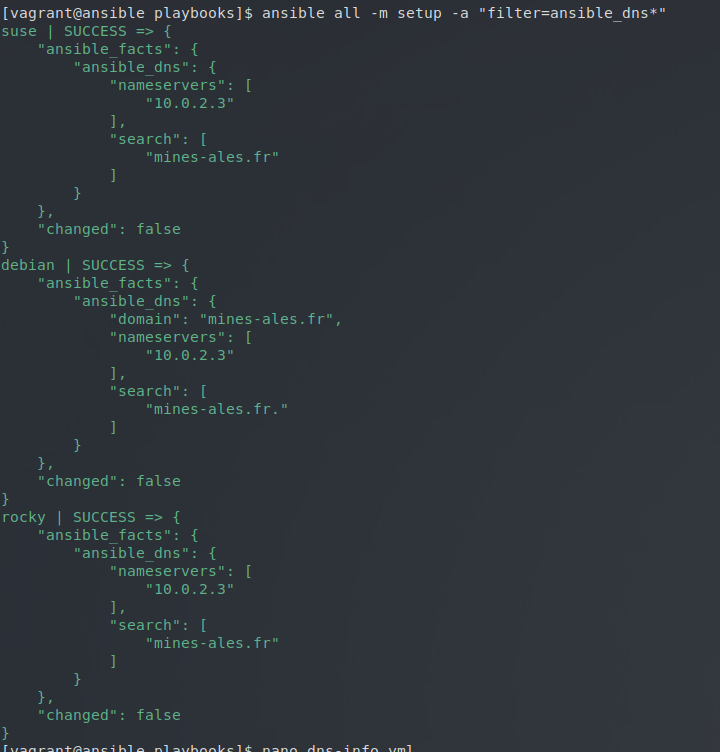
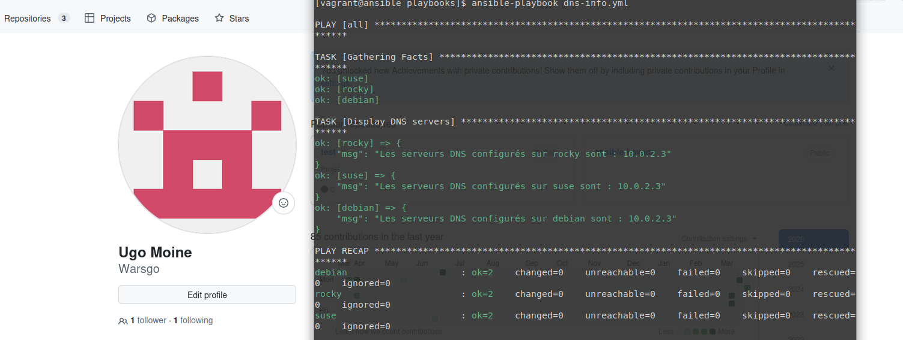

## Atelier 16 : Exploitation des Facts et des Variables Implicites

Ce seizième atelier a eu pour objectif la découverte et l'utilisation des *facts* et des variables implicites. Plusieurs petits playbooks ont été rédigés pour interroger et afficher des métadonnées spécifiques sur les systèmes.

### Initialisation de l'environnement
L'environnement, composé de quatre machines virtuelles hétérogènes, a été initialisé depuis le répertoire `atelier-16`. Une connexion SSH a été établie sur le nœud de contrôle, et le répertoire des playbooks a été rejoint pour activer la configuration via `direnv` :

```bash
cd ~/formation-ansible/atelier-16
vagrant up
vagrant ssh ansible
cd ansible/projets/ema/playbooks/
```
### Rédaction du Playbook : Informations sur le gestionnaire de paquets (pkg-info.yml)

Le premier exercice a consisté à identifier le gestionnaire de paquets du système. La commande ansible all -m setup | grep pkg a permis d'isoler la variable ansible_pkg_mgr.

Un playbook a été créé pour afficher cette information de manière lisible pour chaque hôte cible :

Création du fichier playbooks/pkg-info.yml :
```
---
- hosts: all
  tasks:
    - name: Display package manager information
      debug:
        msg: "L'hôte {{ inventory_hostname }} utilise le gestionnaire de paquets : {{ ansible_pkg_mgr }}"
...
```
Résultat de l'exécution (ansible-playbook pkg-info.yml) :
L'affichage a confirmé que Debian utilise apt, Rocky utilise dnf, et SUSE utilise zypper. 


### Rédaction du Playbook : Version de Python (python-info.yml)

Le deuxième exercice ciblait l'extraction de la version de l'interpréteur Python utilisé par Ansible sur les cibles. En explorant les facts avec le filtre ansible_python*, la variable détaillée ansible_python_version a été identifiée.

Création du fichier playbooks/python-info.yml :
```
---
- hosts: all
  tasks:
    - name: Display Python version
      debug:
        msg: "La version de Python sur l'hôte {{ inventory_hostname }} est la {{ ansible_python_version }}"
...
```
Résultat de l'exécution (ansible-playbook python-info.yml) :
La console a affiché la version exacte de Python 3 installée sur chaque système cible.


### Rédaction du Playbook : Informations DNS (dns-info.yml)

Le dernier exercice demandait de retrouver l'adresse des serveurs DNS configurés sur les cibles. En interrogeant les facts liés au réseau (ansible all -m setup -a "filter=ansible_dns*"), la variable contenant la liste des serveurs a été repérée : ansible_dns.nameservers.



Création du fichier playbooks/dns-info.yml :
```
---
- hosts: all
  tasks:
    - name: Display DNS servers
      debug:
        msg: "Les serveurs DNS configurés sur {{ inventory_hostname }} sont : {{ ansible_dns.nameservers | join(', ') }}"
...
```
Résultat de l'exécution (ansible-playbook dns-info.yml) :
La console a renvoyé les adresses IP des serveurs de résolution de noms utilisés par chacune des machines virtuelles.


### Nettoyage de l'infrastructure

L'atelier s'est conclu par la fermeture de la session sur le Control Host et la destruction complète de l'environnement virtuel :
```
exit
vagrant destroy -f
```
