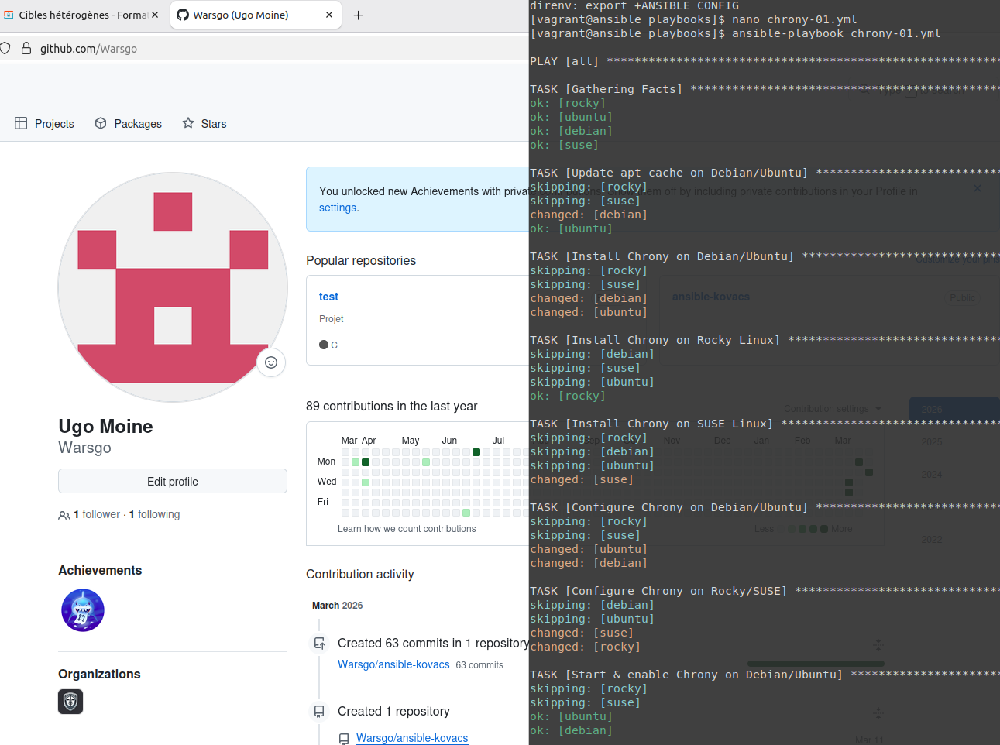
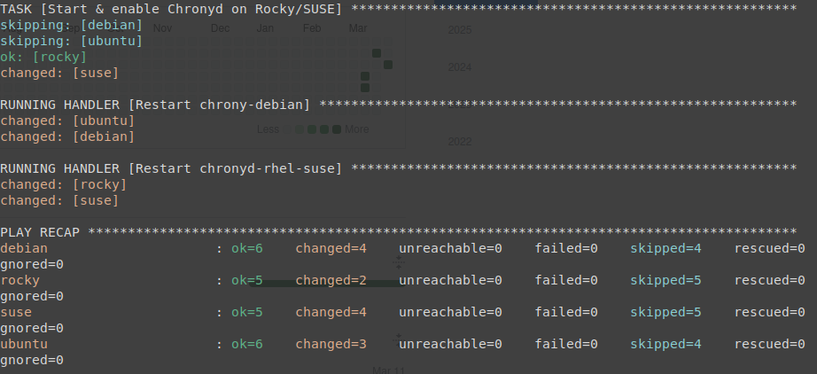
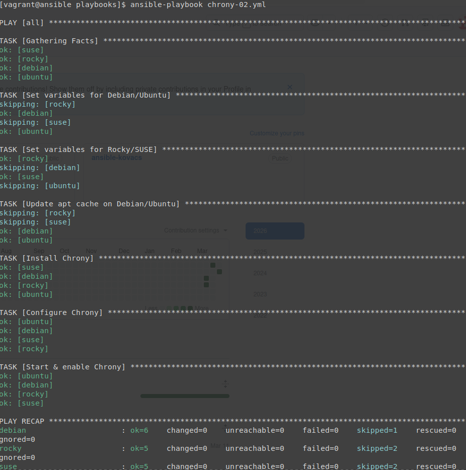

## Atelier 17 : Gestion de cibles hétérogènes avec exécution conditionnelle

Ce dix-septième atelier a été l'occasion d'aborder la complexité liée à la gestion d'un parc de machines hétérogènes. L'objectif était d'apprendre à adapter dynamiquement les tâches d'un playbook aux spécificités de chaque distribution.

### Initialisation de l'environnement
L'environnement, composé de cinq machines virtuelles, a été initialisé depuis le répertoire `atelier-17`. Une connexion SSH a été établie sur le Control Host, et le répertoire de travail du projet a été rejoint :

```
cd ~/formation-ansible/atelier-17
vagrant up
vagrant ssh ansible
cd ansible/projets/ema/playbooks/
```

### Identifier les spécificités des cibles (Chrony)

Avant de rédiger les playbooks, une phase d'investigation a été nécessaire pour identifier les paramètres propres à Chrony sur chaque distribution :
Debian / Ubuntu :
       - Paquet : chrony
       - Service : chrony
       - Fichier de configuration : /etc/chrony/chrony.conf
       
Rocky Linux :
       - Paquet : chrony
       - Service : chronyd
       - Fichier de configuration : /etc/chrony.conf

SUSE :
       - Paquet : chrony
       - Service : chronyd
       - Fichier de configuration : /etc/chrony.conf

### Méthode 1 : chrony-01.yml

Un premier playbook a été rédigé en utilisant une approche très explicite mais répétitive. Chaque tâche (installation, configuration, démarrage) a été dédoublée ou triplée pour s'adapter à la famille de l'OS (ansible_os_family) ou à la distribution exacte (ansible_distribution), en utilisant les gestionnaires de paquets natifs (apt, dnf, zypper).

Création du fichier playbooks/chrony-01.yml :
```
---
- hosts: all
  tasks:
    # --- Installation ---
    - name: Update apt cache on Debian/Ubuntu
      apt:
        update_cache: true
        cache_valid_time: 3600
      when: ansible_os_family == "Debian"

    - name: Install Chrony on Debian/Ubuntu
      apt:
        name: chrony
      when: ansible_os_family == "Debian"

    - name: Install Chrony on Rocky Linux
      dnf:
        name: chrony
      when: ansible_distribution == "Rocky"

    - name: Install Chrony on SUSE Linux
      zypper:
        name: chrony
      when: ansible_distribution == "openSUSE Leap"

    # --- Configuration ---
    - name: Configure Chrony on Debian/Ubuntu
      copy:
        dest: /etc/chrony/chrony.conf
        content: |
          # chrony.conf
          server 0.fr.pool.ntp.org iburst
          server 1.fr.pool.ntp.org iburst
          server 2.fr.pool.ntp.org iburst
          server 3.fr.pool.ntp.org iburst
          driftfile /var/lib/chrony/drift
          makestep 1.0 3
          rtcsync
          logdir /var/log/chrony
      notify: Restart chrony-debian
      when: ansible_os_family == "Debian"

    - name: Configure Chrony on Rocky/SUSE
      copy:
        dest: /etc/chrony.conf
        content: |
          # chrony.conf
          server 0.fr.pool.ntp.org iburst
          server 1.fr.pool.ntp.org iburst
          server 2.fr.pool.ntp.org iburst
          server 3.fr.pool.ntp.org iburst
          driftfile /var/lib/chrony/drift
          makestep 1.0 3
          rtcsync
          logdir /var/log/chrony
      notify: Restart chronyd-rhel-suse
      when: ansible_distribution in ["Rocky", "openSUSE Leap"]

    # --- Activation ---
    - name: Start & enable Chrony on Debian/Ubuntu
      service:
        name: chrony
        state: started
        enabled: true
      when: ansible_os_family == "Debian"

    - name: Start & enable Chronyd on Rocky/SUSE
      service:
        name: chronyd
        state: started
        enabled: true
      when: ansible_distribution in ["Rocky", "openSUSE Leap"]

  # --- Handlers ---
  handlers:
    - name: Restart chrony-debian
      service:
        name: chrony
        state: restarted

    - name: Restart chronyd-rhel-suse
      service:
        name: chronyd
        state: restarted
...
```


### Méthode 2 : chrony-02.yml

Un second playbook a été conçu pour optimiser le code. Au lieu de multiplier les tâches, les spécificités de chaque système ont été enregistrées dans des variables dynamiques (chrony_package, chrony_service, chrony_conf). Le module générique package a été utilisé pour remplacer les appels spécifiques à apt, dnf ou zypper.

Création du fichier playbooks/chrony-02.yml :
```
---
- hosts: all
  tasks:
    # --- Définition des variables ---
    - name: Set variables for Debian/Ubuntu
      set_fact:
        chrony_package: chrony
        chrony_service: chrony
        chrony_conf: /etc/chrony/chrony.conf
      when: ansible_os_family == "Debian"

    - name: Set variables for Rocky/SUSE
      set_fact:
        chrony_package: chrony
        chrony_service: chronyd
        chrony_conf: /etc/chrony.conf
      when: ansible_distribution in ["Rocky", "openSUSE Leap"]

    # --- Exécution générique ---
    - name: Update apt cache on Debian/Ubuntu
      apt:
        update_cache: true
        cache_valid_time: 3600
      when: ansible_os_family == "Debian"

    - name: Install Chrony
      package:
        name: "{{ chrony_package }}"

    - name: Configure Chrony
      copy:
        dest: "{{ chrony_conf }}"
        content: |
          # chrony.conf
          server 0.fr.pool.ntp.org iburst
          server 1.fr.pool.ntp.org iburst
          server 2.fr.pool.ntp.org iburst
          server 3.fr.pool.ntp.org iburst
          driftfile /var/lib/chrony/drift
          makestep 1.0 3
          rtcsync
          logdir /var/log/chrony
      notify: Restart Chrony

    - name: Start & enable Chrony
      service:
        name: "{{ chrony_service }}"
        state: started
        enabled: true

  handlers:
    - name: Restart Chrony
      service:
        name: "{{ chrony_service }}"
        state: restarted
...
```

### Nettoyage de l'infrastructure

L'atelier s'est achevé par la fermeture de la session sur le Control Host et la destruction de l'ensemble des machines virtuelles hétérogènes :
```
exit
vagrant destroy -f
```
