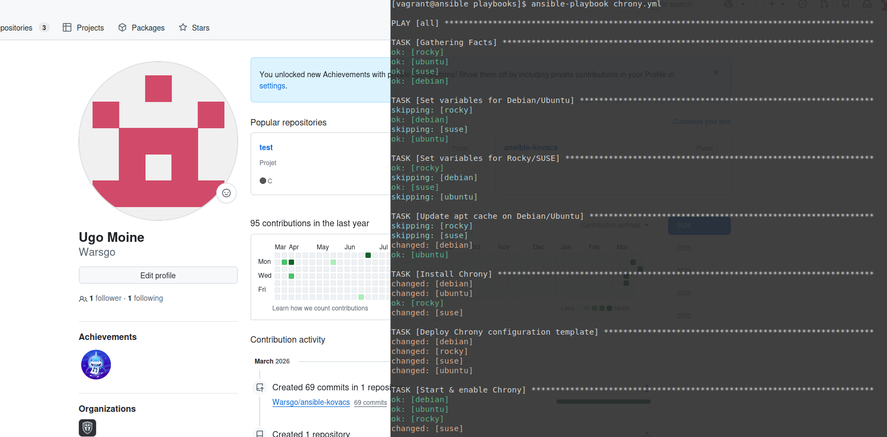
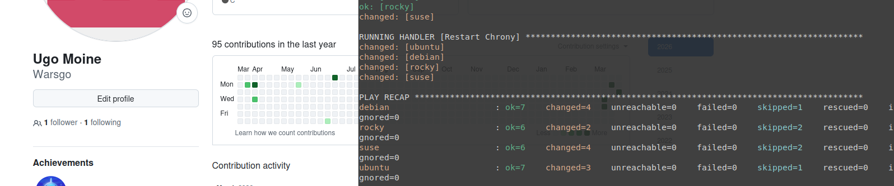

## Atelier 18 : Configurations avec Jinja2 et les Templates

Ce dix-huitième atelier a permis de mettre en pratique l'utilisation du moteur de templating **Jinja2**. L'objectif était de déployer une configuration NTP (Chrony) sur un parc hétérogène, en s'assurant que le fichier de configuration généré sur chaque cible contienne dynamiquement son propre chemin absolu en première ligne de commentaire.

### Initialisation de l'environnement
L'environnement, composé d'un nœud de contrôle et de quatre Target Hosts hétérogènes, a été initialisé depuis le répertoire `atelier-18`. Une connexion SSH a été établie, et le répertoire de travail a été rejoint :

```bash
cd ~/formation-ansible/atelier-18
vagrant up
vagrant ssh ansible
cd ansible/projets/ema/playbooks/
```

### Création du Template Jinja2 (chrony.conf.j2)

Plutôt que d'utiliser un fichier statique avec le module copy, un template dynamique a été créé. Un répertoire templates/ a d'abord été généré à la racine du projet pour y stocker le fichier .j2.

La première ligne du fichier a été modifiée pour inclure la variable {{ chrony_conf }} (qui sera définie dynamiquement dans le playbook en fonction de la distribution).
```bash
mkdir -v templates
nano templates/chrony.conf.j2
```
Contenu du fichier templates/chrony.conf.j2 :
```
# {{ chrony_conf }}
server 0.fr.pool.ntp.org iburst
server 1.fr.pool.ntp.org iburst
server 2.fr.pool.ntp.org iburst
server 3.fr.pool.ntp.org iburst
driftfile /var/lib/chrony/drift
makestep 1.0 3
rtcsync
logdir /var/log/chrony
```
### Rédaction du Playbook (chrony.yml)

Le playbook de l'atelier précédent a été adapté. Le module copy a été remplacé par le module template. Les variables spécifiques à chaque famille d'OS  ont été définies via set_fact en début de play.

Création du fichier playbooks/chrony.yml :
```YAML
---
- hosts: all
  tasks:
    # --- Définition des variables ---
    - name: Set variables for Debian/Ubuntu
      set_fact:
        chrony_package: chrony
        chrony_service: chrony
        chrony_conf: /etc/chrony/chrony.conf
      when: ansible_os_family == "Debian"

    - name: Set variables for Rocky/SUSE
      set_fact:
        chrony_package: chrony
        chrony_service: chronyd
        chrony_conf: /etc/chrony.conf
      when: ansible_distribution in ["Rocky", "openSUSE Leap"]

    # --- Installation ---
    - name: Update apt cache on Debian/Ubuntu
      apt:
        update_cache: true
        cache_valid_time: 3600
      when: ansible_os_family == "Debian"

    - name: Install Chrony
      package:
        name: "{{ chrony_package }}"

    # --- Déploiement du Template ---
    - name: Deploy Chrony configuration template
      template:
        src: chrony.conf.j2
        dest: "{{ chrony_conf }}"
        mode: '0644'
      notify: Restart Chrony

    # --- Activation ---
    - name: Start & enable Chrony
      service:
        name: "{{ chrony_service }}"
        state: started
        enabled: true

  # --- Handlers ---
  handlers:
    - name: Restart Chrony
      service:
        name: "{{ chrony_service }}"
        state: restarted
...
```
### Exécution et Validation

Le playbook a été exécuté, générant les fichiers de configuration de manière dynamique sur chaque cible :
```bash
ansible-playbook chrony.yml
```


Pour vérifier que le moteur Jinja2 avait bien remplacé la variable par le chemin correct sur chaque distribution, des commandes ad hoc ont été lancées depuis le Control Host :
```bash
ansible debian,ubuntu -a "head -n 1 /etc/chrony/chrony.conf"
ansible rocky,suse -a "head -n 1 /etc/chrony.conf"
```
- Les systèmes Debian/Ubuntu ont renvoyé : # /etc/chrony/chrony.conf
- Les systèmes Rocky/SUSE ont renvoyé : # /etc/chrony.conf


### Nettoyage de l'infrastructure

L'atelier s'est conclu par la fermeture de la session sur le nœud de contrôle et la destruction des machines virtuelles :
```bash
exit
vagrant destroy -f
```
