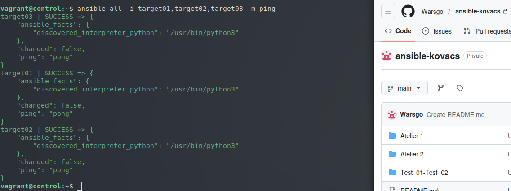

## Atelier 3 : Configuration de la communication SSH et test de connectivité Ansible

Ce troisième atelier pratique a eu pour objectif de configurer la communication sécurisée entre un nœud de contrôle (*Control Host*) et plusieurs nœuds cibles (*Target Hosts*), puis de valider cette connectivité à l'aide d'une commande *ad hoc* Ansible.

### 1. Initialisation de l'environnement
Le répertoire de travail a été basculé sur `atelier-03`. Les quatre machines virtuelles sous Ubuntu (une machine `control` et trois machines `target`) ont été démarrées, suivies d'une connexion SSH sur la machine de contrôle, où Ansible était déjà préinstallé :

```
cd ~/formation-ansible/atelier-03
vagrant up
vagrant ssh control
```
### 2. Configuration de la résolution DNS locale

Pour permettre au Control Host de joindre les Target Hosts par leur nom plutôt que par leur adresse IP, le fichier /etc/hosts a été édité pour refléter l'architecture du réseau.
```
sudo nano /etc/hosts
```
Lignes ajoutées au fichier /etc/hosts :
```
192.168.56.10  control
192.168.56.20  target01
192.168.56.30  target02
192.168.56.40  target03
```
### 3. Mise en place de l'authentification par clé SSH

Afin qu'Ansible puisse exécuter des commandes sur les Target Hosts sans nécessiter de saisie manuelle de mot de passe, une authentification par clé SSH a été mise en place.

Dans un premier temps, les empreintes publiques des machines cibles ont été collectées et enregistrées pour éviter les invites de sécurité SSH interactives :
```
ssh-keyscan -t rsa target01 target02 target03 >> ~/.ssh/known_hosts
```
Une paire de clés SSH a ensuite été générée sur le Control Host, en validant toutes les options par défaut (sans passphrase) :
```
ssh-keygen
```
La clé publique résultante a été propagée sur les trois Target Hosts. Lors de cette opération, le mot de passe de l'utilisateur distant (vagrant) a été renseigné :
```
ssh-copy-id vagrant@target01
ssh-copy-id vagrant@target02
ssh-copy-id vagrant@target03
```
### 4. Validation de la connectivité Ansible

Une fois la relation de confiance établie, un test a été effectué en utilisant le module ping d'Ansible. L'inventaire a été fourni directement en ligne de commande :

ansible all -i target01,target02,target03 -m ping



L'opération s'est déroulée avec succès. Les trois machines cibles ont renvoyé le statut SUCCESS ainsi que la réponse "ping": "pong", confirmant que le Control Host est capable de s'y connecter de manière automatisée et d'y exécuter du code Python via Ansible.

### 5. Nettoyage de l'infrastructure

L'exercice s'est achevé par la fermeture de la session SSH sur le Control Host et la destruction simultanée des quatre machines virtuelles pour libérer l'espace et la mémoire du système hôte :
```
exit
vagrant destroy -f
```
