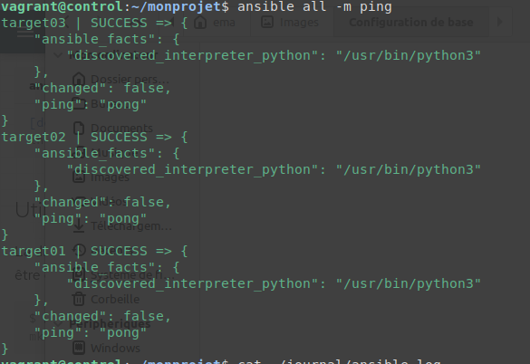
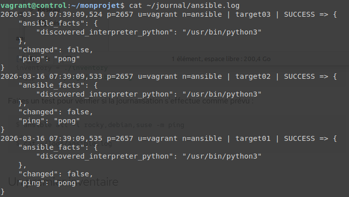
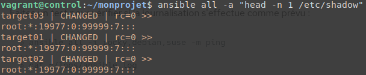

## Atelier 6 : Configuration de base

Ce sixième atelier a servi de synthèse pratique. L'objectif était de déployer une infrastructure complète de quatre machines sous Ubuntu 22.04, d'y installer Ansible, de configurer l'authentification SSH, puis d'organiser un premier répertoire de projet avec ses propres fichiers de configuration et d'inventaire.

### Initialisation de l'infrastructure et résolution DNS
Le répertoire de travail a été positionné sur `atelier-06`. Les quatre machines virtuelles ont été démarrées via Vagrant, suivi d'une connexion SSH sur le nœud de contrôle :

```bash
cd ~/formation-ansible/atelier-06
vagrant up
vagrant ssh control
```

Afin que les machines cibles soient joignables par leur simple nom d'hôte, le fichier /etc/hosts du Control Host a été édité :
```
sudo nano /etc/hosts
```
Lignes ajoutées au fichier :
```
192.168.56.10  control
192.168.56.20  target01
192.168.56.30  target02
192.168.56.40  target03
```
### Installation d'Ansible et authentification SSH

Ansible a été installé sur le Control Host depuis les dépôts officiels d'Ubuntu :
```
sudo apt update
sudo apt install -y ansible
```
L'authentification par clé SSH a ensuite été configurée pour autoriser la connexion sans mot de passe vers les trois cibles. Les empreintes ont d'abord été collectées, une clé a été générée, puis distribuée sur chaque cible :
```
ssh-keyscan -t rsa target01 target02 target03 >> ~/.ssh/known_hosts
ssh-keygen
ssh-copy-id vagrant@target01
ssh-copy-id vagrant@target02
ssh-copy-id vagrant@target03
```
Un premier test de connectivité a été lancé sans configuration spécifique, en spécifiant l'inventaire directement dans la commande :
```
ansible all -i target01,target02,target03 -u vagrant -m ping
```
### Création du projet et du fichier de configuration global

Un répertoire de projet dédié a été créé, dans lequel un fichier de configuration Ansible local a été initialisé :
```
mkdir -v ~/monprojet
cd ~/monprojet
touch ansible.cfg
```
La bonne prise en compte de ce fichier de configuration local par Ansible a été vérifiée :
```
ansible --version | head -n 2
```
Ce fichier ansible.cfg a ensuite été édité pour pointer vers un fichier d'inventaire nommé hosts et pour activer la journalisation dans un répertoire dédié :
```
mkdir -v ~/journal
nano ansible.cfg
```
Contenu du fichier ansible.cfg :
```
[defaults]
inventory = ./hosts
log_path = ~/journal/ansible.log
```
### Configuration de l'inventaire et élévation de privilèges

Un fichier d'inventaire nommé hosts a été créé à la racine du projet pour définir le groupe de machines et les variables de connexion (notamment l'utilisateur par défaut et l'élévation des droits) :
```
nano hosts
```
Contenu du fichier hosts :
```
[testlab]
target01
target02
target03

[testlab:vars]
ansible_user=vagrant
ansible_become=yes
```
Un test de journalisation et de connectivité globale a été effectué en ciblant le groupe implicite all :
```
ansible all -m ping
cat ~/journal/ansible.log
```


Grâce à la directive ansible_become=yes définie dans l'inventaire, Ansible dispose désormais des droits d'administration. Une commande requérant des privilèges root a été envoyée pour afficher la première ligne du fichier /etc/shadow sur toutes les cibles :
```
ansible all -a "head -n 1 /etc/shadow"
```

### Nettoyage de l'environnement

Pour terminer, la session sur le Control Host a été fermée et l'ensemble des machines virtuelles de l'atelier a été détruit :
```
exit
vagrant destroy -f
```
