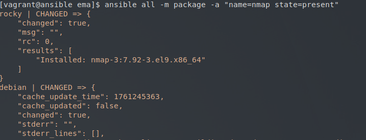
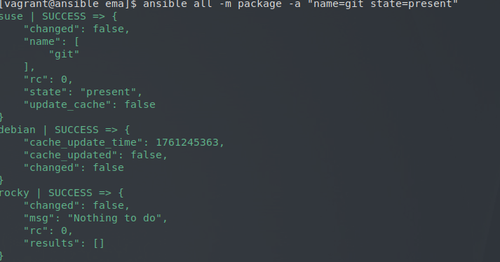
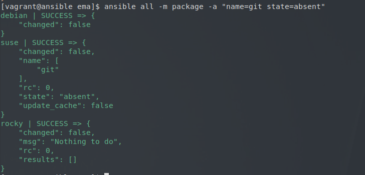
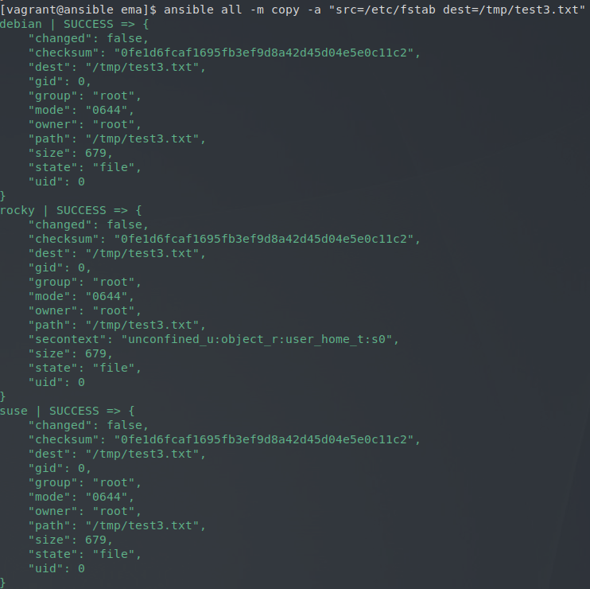
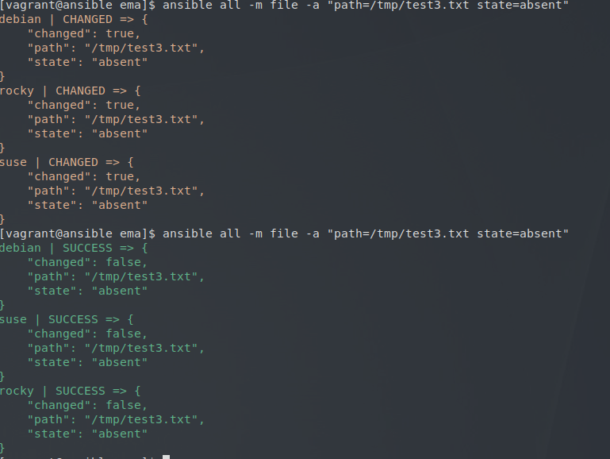
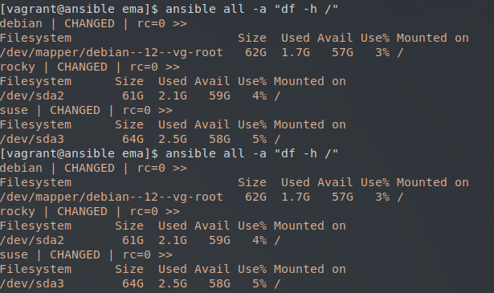

## Atelier 7 : Découverte et validation de l'idempotence

Ce septième atelier a été dédié à la mise en pratique de l'**idempotence**, un concept fondamental d'Ansible garantissant qu'une opération exécutée plusieurs fois produira toujours le même état final, sans réappliquer inutilement des modifications si la cible est déjà dans l'état souhaité.

### Initialisation de l'environnement
L'environnement préconfiguré de l'atelier a été démarré. Une session SSH a été ouverte sur le Control Host, puis le répertoire de travail a été positionné à la racine du projet Ansible existant :

```
cd ~/formation-ansible/atelier-07
vagrant up
vagrant ssh ansible
cd ansible/projets/ema/
```
### Installation de paquets

Pour observer le comportement d'Ansible, une série d'installations logicielles a été lancée sur l'ensemble des Target Hosts en utilisant le module générique package. L'opération a été répétée deux fois pour chaque paquet (tree, git, nmap) :
```
ansible all -m package -a "name=tree state=present"
ansible all -m package -a "name=git state=present"
ansible all -m package -a "name=nmap state=present"
```


Observation :
- Lors de la première exécution : Ansible a détecté l'absence des paquets, a procédé à leur installation, et a retourné un statut CHANGED True.
- Lors de la seconde exécution : Ansible a vérifié l'état des cibles, a constaté que les paquets étaient déjà présents, et n'a effectué aucune action. Le statut retourné a été SUCCESS avec la valeur changed: false.

### Désinstallation des paquets

La procédure inverse a ensuite été réalisée en modifiant l'état attendu avec le paramètre state=absent. Les commandes ont également été exécutées deux fois :
```
ansible all -m package -a "name=tree state=absent"
ansible all -m package -a "name=git state=absent"
ansible all -m package -a "name=nmap state=absent"
```

Le même comportement idempotent a été observé : désinstallation effective avec le statut CHANGED lors du premier passage, puis aucune action avec le statut SUCCESS lors du second.
### Gestion des fichiers : Copie

Un test d'idempotence a été appliqué à la gestion des fichiers. Le fichier /etc/fstab du Control Host a été copié vers le répertoire /tmp/ des Target Hosts via le module copy :
```
ansible all -m copy -a "src=/etc/fstab dest=/tmp/test3.txt"
```


Une seconde exécution de cette commande n'a généré aucune modification, Ansible ayant calculé que le fichier source et le fichier de destination avaient un contenu identique.
### Gestion des fichiers : Suppression

Le fichier précédemment copié a été supprimé à l'aide du module file combiné au paramètre state=absent :
```
ansible all -m file -a "path=/tmp/test3.txt state=absent"
```

Comme pour les paquets, la première exécution a supprimé le fichier (CHANGED), tandis que la seconde n'a fait que confirmer son absence (SUCCESS / changed: false).
### Les limites de l'idempotence : Exécution de commandes brutes

Pour clôturer l'exercice, une vérification de l'espace disque de la partition principale a été lancée en utilisant le module par défaut command :
```
ansible all -a "df -h /"
```

Contrairement aux modules d'état (package, copy, file), le module command n'est pas idempotent par défaut. À chaque exécution de cette commande, Ansible a retourné le statut CHANGED.

### Nettoyage de l'infrastructure

La session sur le Control Host a été clôturée et les machines virtuelles ont été détruites :
```
exit
vagrant destroy -f
```
