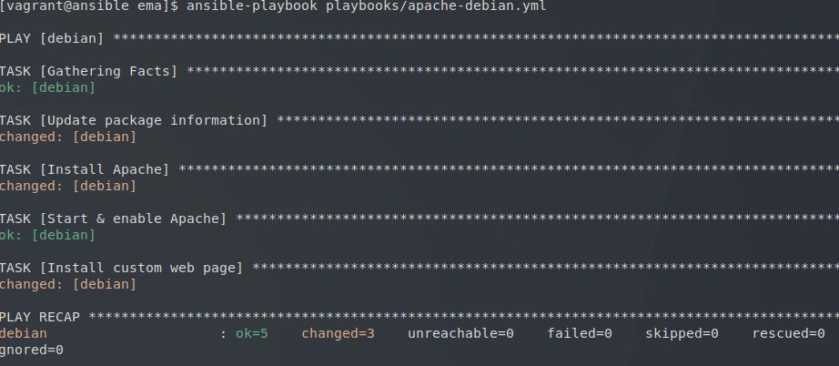
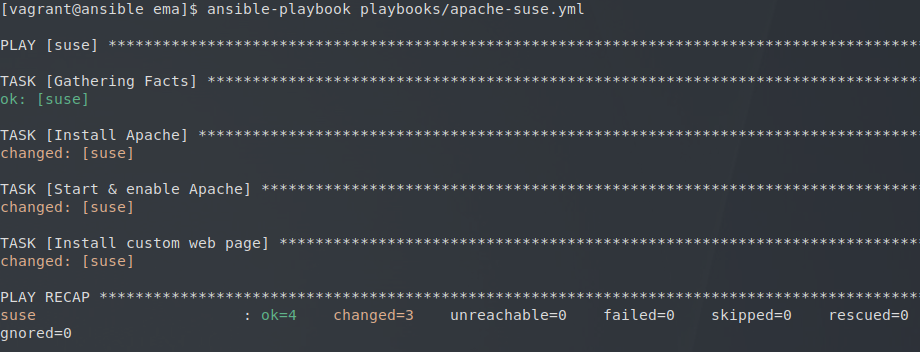
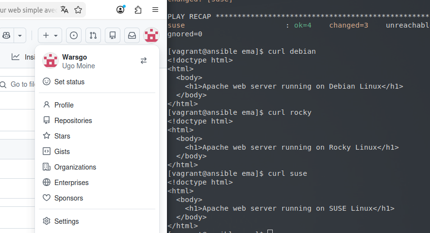

## Atelier 10 : Déploiement d'Apache via des Playbooks hétérogènes

Ce dixième atelier a eu pour objectif la création et l'exécution de trois playbooks Ansible distincts, afin de déployer un serveur web Apache basique sur trois distributions Linux différentes (Debian, Rocky Linux, et SUSE), en tenant compte de leurs spécificités (noms de paquets, gestionnaires de paquets, etc.).

### Initialisation de l'environnement
L'environnement de travail a été positionné sur le répertoire `atelier-10`. Les quatre machines virtuelles (un Control Host et trois Target Hosts hétérogènes) ont été démarrées, suivies d'une connexion SSH sur le nœud de contrôle et d'un basculement dans le répertoire du projet Ansible :

```
cd ~/formation-ansible/atelier-10
vagrant up
vagrant ssh ansible
cd ansible/projets/ema/
```
La bonne prise en compte de la configuration via direnv a été confirmée lors de l'accès au répertoire du projet.
### Rédaction du Playbook pour Debian (apache-debian.yml)

Un premier playbook a été rédigé dans le répertoire playbooks pour cibler spécifiquement l'hôte debian. Il utilise le module apt pour rafraîchir le cache et installer le paquet apache2, puis le module service pour s'assurer de son démarrage, et enfin le module copy pour déployer une page web personnalisée.

Création du fichier playbooks/apache-debian.yml :
```
---
- hosts: debian
  tasks:
    - name: Update package information
      apt:
        update_cache: true
        cache_valid_time: 3600

    - name: Install Apache
      apt:
        name: apache2

    - name: Start & enable Apache
      service:
        name: apache2
        state: started
        enabled: true

    - name: Install custom web page
      copy:
        dest: /var/www/html/index.html
        mode: 0644
        content: |
          <!doctype html>
          <html>
            <body>
              <h1>Apache web server running on Debian Linux</h1>
            </body>
          </html>
...
```

### Rédaction du Playbook pour Rocky Linux (apache-rocky.yml)

Un second playbook a été créé pour cibler l'hôte rocky. Sur cette distribution de la famille Red Hat, le gestionnaire de paquets est dnf. Le paquet Apache et le service associé portent le nom de httpd. . La racine web par défaut reste /var/www/html/.

Création du fichier playbooks/apache-rocky.yml :
```
---
- hosts: rocky
  tasks:
    - name: Install Apache
      dnf:
        name: httpd
        state: present

    - name: Start & enable Apache
      service:
        name: httpd
        state: started
        enabled: true

    - name: Install custom web page
      copy:
        dest: /var/www/html/index.html
        mode: 0644
        content: |
          <!doctype html>
          <html>
            <body>
              <h1>Apache web server running on Rocky Linux</h1>
            </body>
          </html>
...
```

### Rédaction du Playbook pour SUSE (apache-suse.yml)

Un troisième playbook a été rédigé pour l'hôte suse. Le gestionnaire de paquets utilisé par Ansible est ici zypper. Le nom du paquet Apache et du service est apache2, mais la racine web par défaut sous SUSE diffère et se situe dans /srv/www/htdocs/.

Création du fichier playbooks/apache-suse.yml :
```
---
- hosts: suse
  tasks:
    - name: Install Apache
      zypper:
        name: apache2
        state: present

    - name: Start & enable Apache
      service:
        name: apache2
        state: started
        enabled: true

    - name: Install custom web page
      copy:
        dest: /srv/www/htdocs/index.html
        mode: 0644
        content: |
          <!doctype html>
          <html>
            <body>
              <h1>Apache web server running on SUSE Linux</h1>
            </body>
          </html>
...
```

### Vérification globale et nettoyage

Pour valider le bon fonctionnement des trois serveurs web, une requête curl a été envoyée depuis le Control Host vers chaque cible :
```
curl debian
curl rocky
curl suse
```


Chaque commande a retourné le code HTML contenant le titre correspondant à la distribution ciblée, confirmant le succès du déploiement hétérogène.

Pour clôturer l'exercice, la session sur le nœud de contrôle a été quittée et l'ensemble des machines virtuelles a été détruit :
```
exit
vagrant destroy -f
```
