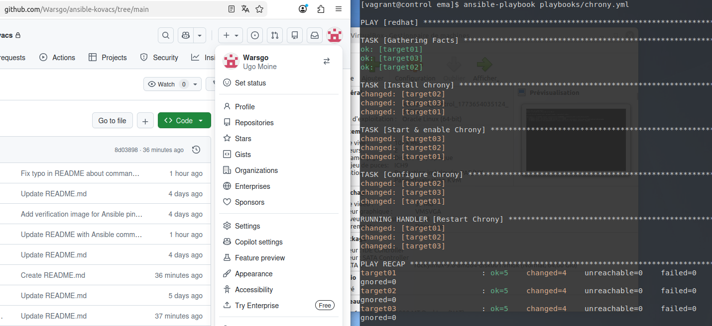
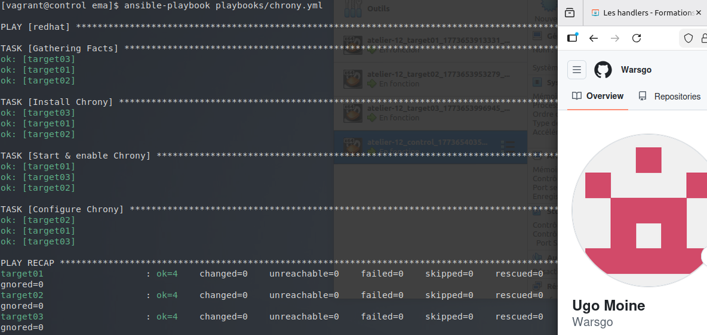

## Atelier 12 : Maîtrise de l'idempotence avancée avec les Handlers

Ce douzième atelier a été consacré à l'intégration des **handlers**. L'objectif était de déployer et de configurer le service de synchronisation temporelle NTP (via Chrony) sur un parc de machines sous Rocky Linux. Les handlers ont été utilisés pour garantir que le redémarrage du service ne se déclenche *que* si le fichier de configuration a été effectivement modifié.

### Initialisation de l'environnement
Le répertoire de travail a été défini sur `atelier-12`. L'infrastructure, composée de quatre machines virtuelles sous Rocky Linux, a été démarrée. Une session SSH a été ouverte sur le nœud de contrôle et le répertoire du projet a été rejoint :

```
cd ~/formation-ansible/atelier-12
vagrant up
vagrant ssh control
cd ansible/projets/ema/
```
La bonne activation de l'environnement via direnv a été vérifiée automatiquement à l'entrée dans le répertoire. 
### Rédaction du Playbook avec Handlers (chrony.yml)

Un nouveau playbook a été rédigé dans le répertoire playbooks pour automatiser l'installation et la configuration de Chrony.

Ce playbook suit une structure précise :

- Installation et activation : Le paquet chrony est installé via le module dnf et le service chronyd est activé et démarré via le module service.

- Configuration : Le module copy est utilisé pour déployer le fichier de configuration personnalisé. La directive notify est ajoutée à cette tâche. Elle indique à Ansible de déclencher un handler nommé "Restart Chrony" uniquement si le fichier a été modifié (CHANGED).

- Le Handler : Une section handlers est déclarée en fin de playbook. Elle contient la tâche de redémarrage.

Création du fichier playbooks/chrony.yml :
```
---
- hosts: redhat
  tasks:
    - name: Install Chrony
      dnf:
        name: chrony
        state: present

    - name: Start & enable Chrony
      service:
        name: chronyd
        state: started
        enabled: true

    - name: Configure Chrony
      copy:
        dest: /etc/chrony.conf
        mode: 0644
        content: |
          # /etc/chrony.conf
          server 0.fr.pool.ntp.org iburst
          server 1.fr.pool.ntp.org iburst
          server 2.fr.pool.ntp.org iburst
          server 3.fr.pool.ntp.org iburst
          driftfile /var/lib/chrony/drift
          makestep 1.0 3
          rtcsync
          logdir /var/log/chrony
      notify: Restart Chrony

  handlers:
    - name: Restart Chrony
      service:
        name: chronyd
        state: restarted
...
```
### Validation syntaxique et première exécution

Avant de lancer le déploiement, la syntaxe YAML du playbook a été validée à l'aide de l'outil yamllint :
```
yamllint playbooks/chrony.yml
```
Le playbook a ensuite été exécuté une première fois :
```
ansible-playbook playbooks/chrony.yml
```
Lors de ce premier passage, Ansible a installé le paquet, démarré le service, et mis en place le fichier de configuration (CHANGED). La tâche de configuration ayant modifié l'état du système, la notification a été envoyée et le message RUNNING HANDLER [Restart Chrony] est apparu en fin d'exécution, confirmant le redémarrage du service pour prendre en compte les nouveaux serveurs NTP.



### Vérification de l'idempotence totale

Afin de valider le comportement du handler, le playbook a été exécuté une seconde fois à l'identique :
```
ansible-playbook playbooks/chrony.yml
```
Lors de cette seconde passe, Ansible a vérifié l'état des paquets, du service, et du fichier de configuration. Aucun écart n'ayant été constaté (le statut de toutes les tâches était SUCCESS / changed: false), le handler n'a pas été notifié et n'a donc pas été exécuté. Le service chronyd n'a pas subi de redémarrage inutile, garantissant ainsi l'idempotence parfaite du playbook.



### Nettoyage de l'environnement

L'atelier s'est achevé par la fermeture de la session sur le Control Host et la destruction de l'ensemble de l'infrastructure virtuelle :
```
exit
vagrant destroy -f
```
