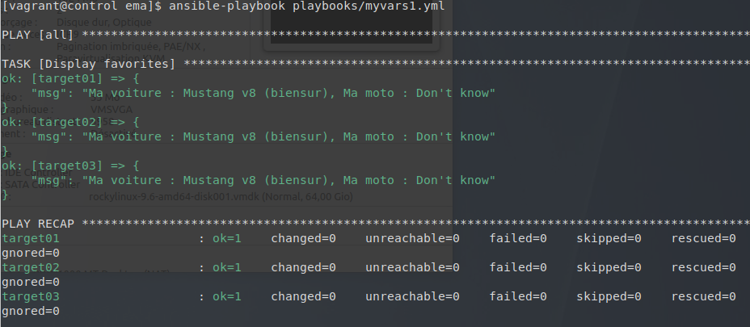
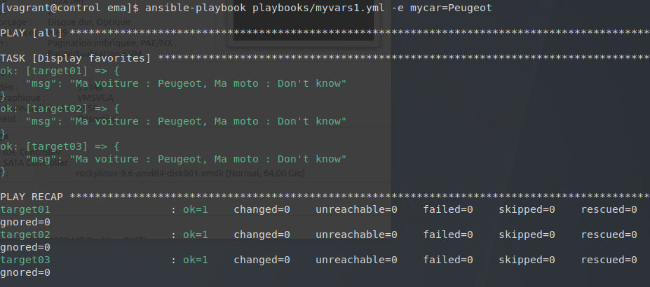
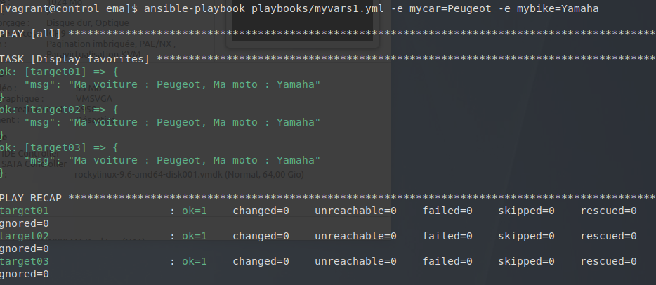
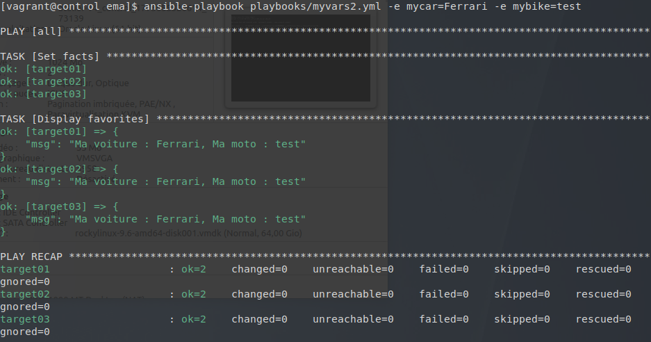
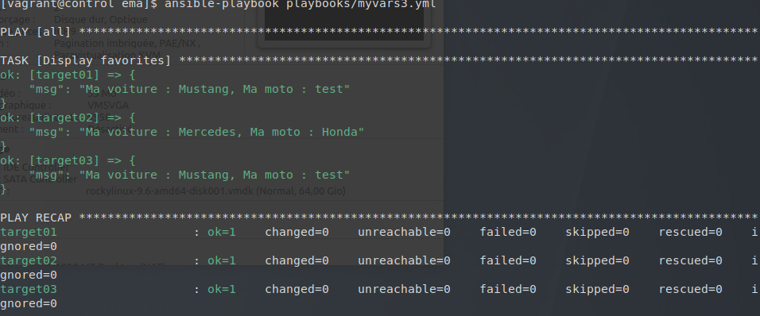
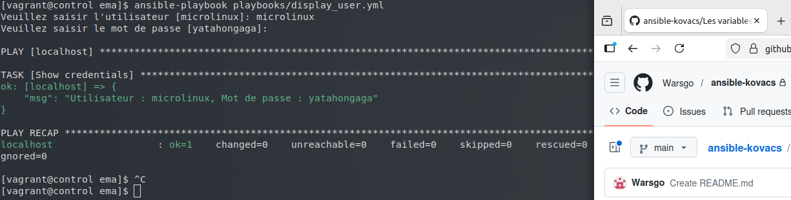

##  Atelier 14 : Gestion et précédence des variables Ansible

Ce quatorzième atelier a été dédié à la manipulation des variables dans Ansible. L'objectif était de comprendre comment déclarer des variables à différents endroits et d'observer les règles de précédence qui s'appliquent lorsque plusieurs définitions entrent en conflit.

### Initialisation de l'environnement
L'environnement, composé de quatre machines virtuelles sous Rocky Linux, a été initialisé depuis le répertoire `atelier-14`. Une connexion SSH a été établie sur le nœud de contrôle, et le répertoire du projet a été rejoint pour activer la configuration via `direnv` :

```
cd ~/formation-ansible/atelier-14
vagrant up
vagrant ssh control
cd ansible/projets/ema/
```
### Variables de Play et Extra Vars (myvars1.yml)

Un premier playbook a été créé pour définir deux variables (mycar et mybike) directement dans l'entête du play via la section vars. Le module debug a été utilisé pour afficher leur contenu.

Création du fichier playbooks/myvars1.yml :
```
---
- hosts: all
  gather_facts: false
  vars:
    mycar: Mustang v8 (biensur)
    mybike: Don't know
  tasks:
    - name: Display favorites
      debug:
        msg: "Ma voiture : {{ mycar }}, Ma moto : {{ mybike }}"
...
```
Le playbook a d'abord été exécuté normalement, affichant les valeurs par défaut du play. Ensuite, des tests de précédence ont été réalisés en utilisant l'option -e (--extra-vars) en ligne de commande pour écraser les valeurs :
```
ansible-playbook playbooks/myvars1.yml
ansible-playbook playbooks/myvars1.yml -e mycar=Peugeot
ansible-playbook playbooks/myvars1.yml -e mycar=Peugeot -e mybike=Yamaha
```



Les valeurs passées via extra vars ont systématiquement remplacé les valeurs définies dans la section vars du playbook, confirmant que les extra vars possèdent la priorité absolue.

#### Variables dynamiques avec set_fact (myvars2.yml)

Un second playbook a été rédigé pour reproduire le comportement précédent, mais en définissant les variables dynamiquement au cours de l'exécution grâce au module set_fact.

Création du fichier playbooks/myvars2.yml :
```
---
- hosts: all
  gather_facts: false
  tasks:
    - name: Set facts
      set_fact:
        mycar: Peugeot
        mybike: Suzuki

    - name: Display favorites
      debug:
        msg: "Ma voiture : {{ mycar }}, Ma moto : {{ mybike }}"
...
```

Tout comme pour le premier exercice, l'écrasement de ces variables par des extra vars a été testé :
```
ansible-playbook playbooks/myvars2.yml -e mycar=Ferrari -e mybike=test
```

Le résultat a confirmé que même face à des variables créées dynamiquement par set_fact au moment de l'exécution, les extra vars conservent la priorité.
### Variables de Groupe et d'Hôte (myvars3.yml)

Le troisième exercice a consisté à externaliser la définition des variables dans l'arborescence du projet. Un playbook myvars3.yml a été créé sans aucune définition de variable, contenant uniquement la tâche debug.

Création du fichier playbooks/myvars3.yml :
```
---
- hosts: all
  gather_facts: false
  tasks:
    - name: Display favorites
      debug:
        msg: "Ma voiture : {{ mycar }}, Ma moto : {{ mybike }}"
...
```
Des valeurs par défaut ont été définies pour l'ensemble du parc en créant un fichier all.yml dans le répertoire group_vars :
```
mkdir -v group_vars
nano group_vars/all.yml
```
Contenu de group_vars/all.yml :
```
---
mycar: Mustang
mybike: test
...
```
Ensuite, une exception a été configurée spécifiquement pour l'hôte target02 en créant un fichier dédié dans le répertoire host_vars :
```
mkdir -v host_vars
nano host_vars/target02.yml
```
Contenu de host_vars/target02.yml :
```
---
mycar: Mercedes
mybike: Honda
...
```

Lors de l'exécution du playbook (ansible-playbook playbooks/myvars3.yml), l'affichage a confirmé que target01 et target03 ont hérité de Mustang/test, tandis que target02 a affiché Mercedes/Honda. Cela démontre que les variables de niveau hôte (host_vars) priment sur les variables de groupe (group_vars).
### Variables interactives (display_user.yml)

Le dernier exercice s'est concentré sur la définition interactive de variables au lancement du playbook à l'aide de la directive vars_prompt.

Création du fichier playbooks/display_user.yml :
```
---
- hosts: localhost
  gather_facts: false
  vars_prompt:
    - name: user
      prompt: "Veuillez saisir l'utilisateur"
      default: microlinux
      private: false
    - name: password
      prompt: "Veuillez saisir le mot de passe"
      default: yatahongaga
      private: true
  tasks:
    - name: Show credentials
      debug:
        msg: "Utilisateur : {{ user }}, Mot de passe : {{ password }}"
...
```

Lors du lancement (ansible-playbook playbooks/display_user.yml), le terminal a mis en pause l'exécution pour demander les valeurs. Le mot de passe a été masqué lors de la frappe grâce à la directive private: true.
### Nettoyage de l'infrastructure

La session sur le Control Host a été clôturée et les machines virtuelles ont été détruites pour libérer l'environnement :
```
exit
vagrant destroy -f
```
