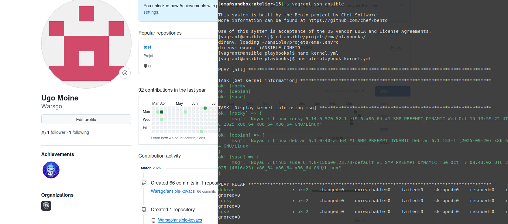
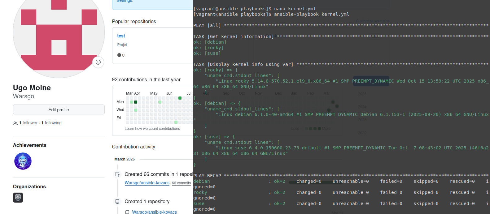
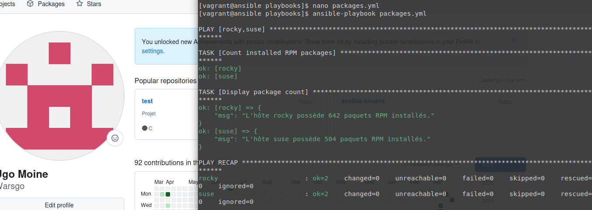

## Atelier 15 : Maîtrise des Variables Enregistrées 

Ce quinzième atelier a permis de comprendre comment capturer et exploiter la sortie de commandes arbitraires exécutées sur les Target Hosts. L'objectif était d'utiliser la directive `register` pour enregistrer le résultat des modules impératifs (`command` ou `shell`) dans une variable, puis d'en afficher le contenu pertinent, tout en gérant correctement l'idempotence.

### Initialisation de l'environnement
L'environnement, composé d'un Control Host et de trois Target Hosts (Rocky, Debian, SUSE), a été déployé depuis le répertoire `atelier-15`. Une connexion SSH a été ouverte sur le nœud de contrôle et le répertoire de travail du projet a été rejoint pour activer la configuration via `direnv` :

```bash
cd ~/formation-ansible/atelier-15
vagrant up
vagrant ssh ansible
cd ansible/projets/ema/playbooks/
```

### Rédaction du Playbook : Informations détaillées du noyau (kernel.yml)

Le premier exercice a consisté à récupérer les informations du noyau de toutes les cibles en utilisant la commande système uname -a.

Dans un premier temps, l'affichage a été réalisé avec le paramètre msg du module debug :

Création du fichier playbooks/kernel.yml :
```YAML
---
- hosts: all
  gather_facts: false
  tasks:
    - name: Get kernel information
      command: uname -a
      changed_when: false
      register: uname_cmd

    - name: Display kernel info using msg
      debug:
        msg: "Noyau : {{ uname_cmd.stdout }}"
...
```
Résultat de l'exécution (ansible-playbook kernel.yml) :
L'affichage a renvoyé la chaîne de caractères complète (stdout) de la commande uname -a pour chaque cible.


Ensuite, le playbook a été modifié pour utiliser la syntaxe alternative, avec le paramètre var :

Modification de la tâche d'affichage dans kernel.yml :
```YAML
    - name: Display kernel info using var
      debug:
        var: uname_cmd.stdout_lines
```


### Rédaction du Playbook : Dénombrement des paquets installés (packages.yml)

Le second exercice ciblait uniquement les distributions utilisant le gestionnaire RPM (Rocky Linux et SUSE). L'objectif était de compter le nombre total de paquets installés en utilisant la commande combinée rpm -qa | wc -l.

Création du fichier playbooks/packages.yml :
```YAML
---
- hosts: rocky,suse
  gather_facts: false
  tasks:
    - name: Count installed RPM packages
      shell: rpm -qa | wc -l
      changed_when: false
      register: rpm_count

    - name: Display package count
      debug:
        msg: "L'hôte {{ inventory_hostname }} possède {{ rpm_count.stdout }} paquets RPM installés."
...
```
Résultat de l'exécution (ansible-playbook packages.yml) :
L'exécution s'est déroulée avec succès en omettant délibérément la machine Debian. Le module debug a renvoyé le chiffre exact correspondant au décompte des paquets pour Rocky et SUSE.


### Nettoyage de l'infrastructure

L'atelier s'est achevé par la fermeture de la session sur le Control Host et la destruction de l'ensemble des machines virtuelles :
```bash
exit
vagrant destroy -f
```
